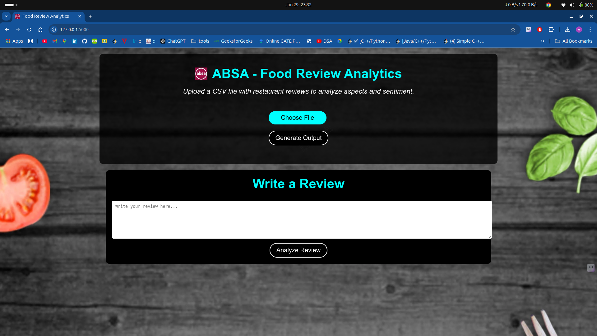
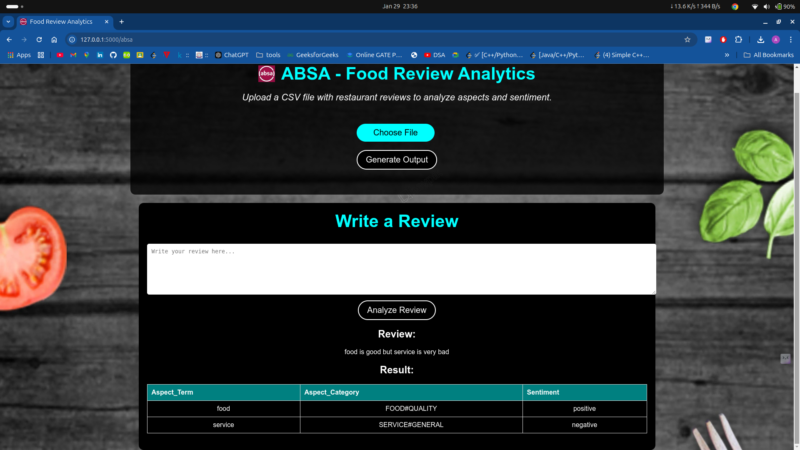
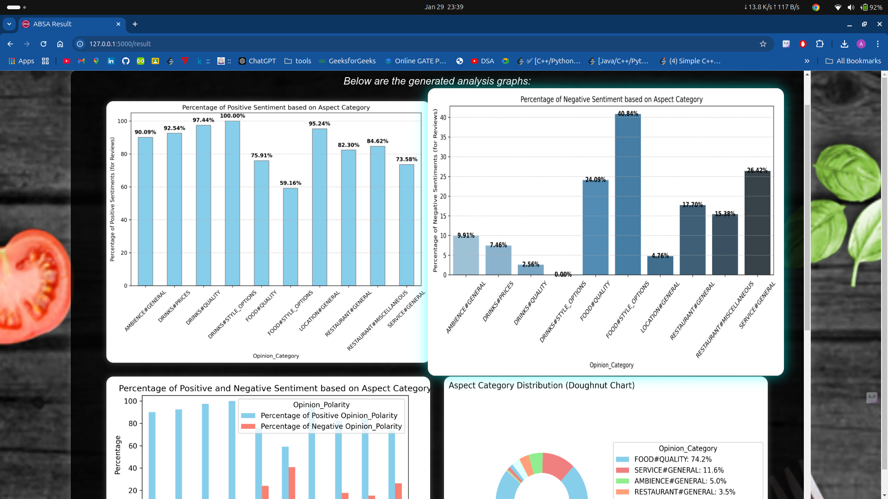

# Food Review Analytics (ABSA)

## Overview
Food Review Analytics is a web application that utilizes Aspect-Based Sentiment Analysis (ABSA) to provide insights into restaurant reviews. This application allows users to upload a CSV file with restaurant reviews or enter a text review. It then analyzes the reviews, extracting aspects and sentiments to provide a detailed analysis of the culinary experience.

## Features
- **File Upload:** Users can upload a CSV file containing restaurant reviews for bulk analysis.
- **Review Submission:** Users can enter a text review to receive an instant analysis.
- **Aspect Extraction:** The application extracts aspects (e.g., "food quality," "service," "ambiance") from the reviews.
- **Sentiment Analysis:** It determines the sentiment (positive, negative, or neutral) associated with each aspect.
- **Visualization:** The application generates various charts to visualize aspects like aspect-category distribution, sentiment analysis, and more.

## Dependencies
- Python 3.x
- Flask
- SpaCy
- NLTK
- scikit-learn
- pandas
- textblob
- matplotlib
- seaborn
- deep_translator
- GoogleTranslator (Python client for Google Translate)

## How to Use
1. Clone the repository to your local machine.
2. Install the required dependencies using `pip install -r requirements.txt`.
3. Run the Flask application: `python app.py`.
4. Access the application through your web browser.
5. You can either upload a CSV file with restaurant reviews or enter a text review for analysis.
6. The application will provide an analysis of aspects and sentiments based on the input.

---

## 🖥️ **Screenshots**
Below are some previews of the application interface:

### 📌 Homepage

### 📌 Review Analysis Page

### 📌 Sentiment Distribution Graph

---

## Acknowledgment

### Libraries
This project utilizes several open-source libraries and tools:

- [Spacy](https://spacy.io/): A natural language processing library.
- [NLTK](https://www.nltk.org/): The Natural Language Toolkit for Python.
- [scikit-learn](https://scikit-learn.org/): A machine learning library.
- [Deep Translator](https://pypi.org/project/deep-translator/): A language translation tool.
- [Matplotlib](https://matplotlib.org/): A data visualization library.
- [Seaborn](https://seaborn.pydata.org/): A data visualization library based on Matplotlib.
- [VADER Sentiment Analysis](https://github.com/cjhutto/vaderSentiment): A lexicon and rule-based sentiment analysis tool.
- [jQuery](https://jquery.com/): A JavaScript library for web development.

### Dataset
The dataset used in this project was obtained from 
[Kaggle](https://www.kaggle.com/datasets/charitarth/semeval-2014-task-4-aspectbasedsentimentanalysis/data?select=Restaurants_Train_v2.csv).
 We would like to acknowledge the data contributors and the Kaggle community for making this dataset available.

If you use this project for educational purposes, please make sure to follow Kaggle's terms and conditions regarding dataset usage and attribution.

## Author
- Apoorv Gupta
## License
This project is for educational use only. No distribution or reproduction without permission.

